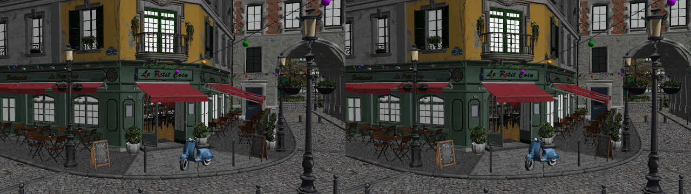
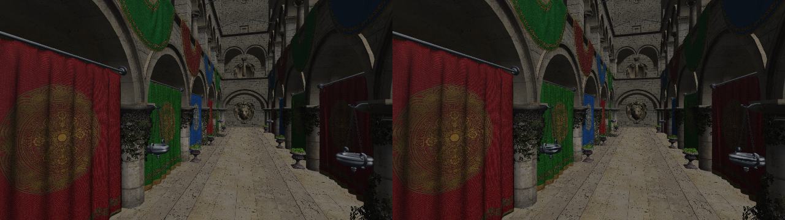
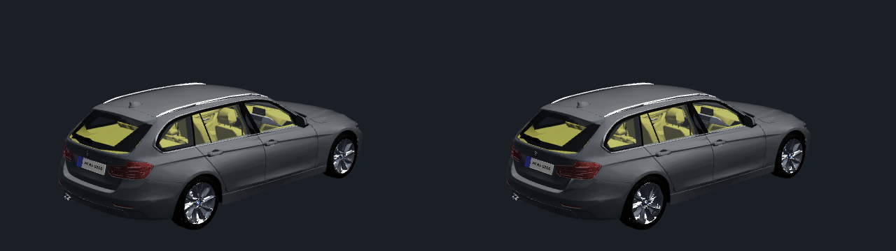
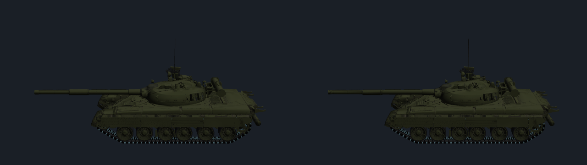

# Stronger automatic LOD with projected-error selection

Status: removed from the product on 2026-10-09 at the user's request. The optional selector, runtime LOD loader and rendering path are gone. Sources and historical validation remain here.

This extends the conservative [geometry proxy experiment](../scene-temporal-geometry-proxies/README.md).
Original packs, textures, materials, cameras and render resolution remain the
inputs. An offline tool prepares geometry alternatives; the C11 viewer selects
them automatically per spatial group and frame. No material or final-color
history is reused. Current lighting is freshly evaluated.

## Sources

- [meshoptimizer v1.3 README](https://github.com/zeux/meshoptimizer/blob/v1.3/README.md),
  simplification, attribute-aware/permissive simplification and clustered LOD.
- [v1.3 API](https://github.com/zeux/meshoptimizer/blob/v1.3/src/meshoptimizer.h),
  `meshopt_simplifyWithAttributes`, `SimplifyPermissive`, `LockBorder`,
  `Sparse`, `ErrorAbsolute` and `ErrorClamped`; corresponding local vendored
  implementation reviewed before this trial.
- Garland and Heckbert, [Surface Simplification Using Quadric Error Metrics](https://www.cs.cmu.edu/~garland/quadrics/),
  SIGGRAPH 1997.

## Change

The old LODs preserved folds, prohibited collapses across attribute seams and
limited absolute object-space error to 0.02. This experiment permits attribute
seam collapses within one material and allows up to 5% of the cluster's largest
object-space extent. Attribute weights still include normals and UVs. Cluster
boundaries remain locked; source vertices and all their attributes are copied
unchanged. Alpha-cutout and transparent parts stay at full detail. No component
pruning or vertex updates are enabled. An empty simplification result retains
the original group instead of deleting it.

V4 also locks support vertices in 26 object-space directions. Each output tier
must still reference their positions, including equivalent seam duplicates;
otherwise that tier retains the entire original group. This preserves selected
extremities and the object-space bounding box. It does not prove that all
silhouettes, holes or interior disconnected features survive. Native image
inspection found a shortened T-80 antenna in V2 despite low average error;
that version must not be adopted on the strength of its timing result.

Three independent tiers target 25/5/1% of source indices; these are requests,
not achieved triangle counts. Select the lowest actual triangle count that
fits a projected-error budget, rather than assuming tier numbers imply lower
cost. Refine immediately when the selected error grows too large. Coarsen only
after three frames below 75% of the budget. This history contains tier choices,
not colors or old lighting. Eye/near-plane ambiguity retains original geometry.

The candidate budget is 2 pixels; `fine` uses 1, `coarse` uses 4, and `control`
always selects the repacked original triangles. These are projection heuristics
using simplifier error, **not proven bounds on rendered pixel or texture error**.
Control has the same geometric triangle multiset, but reorderings can change
floating-point rounding and depth ties. Silhouettes, holes, texture deformation
and temporal popping must be assessed separately.

## Reproduction

```sh
build/python/bin/python experiments/scene-screen-error-lod/prepare_lod.py \
  --output-root build/scene-screen-error-lod/new --clusters
cmake -S experiments/scene-screen-error-lod \
  -B build/scene-screen-error-lod/new/native -DCMAKE_BUILD_TYPE=Release \
  -DCMAKE_C_COMPILER="$HOME/.local/bin/clang-22" \
  -DSCENE_TRIAL_ROOT="$PWD/build/scene-screen-error-lod/new"
cmake --build build/scene-screen-error-lod/new/native -j4
```

Native library and viewer compilation use SSE4.1 with AVX/AVX2/AVX512 disabled.
The offline C++17 simplifier has the same width restrictions; it is never linked
into libsoftgl. Renderer source and the native library archive remain unchanged;
the optimization is automatic mesh selection in the scene viewer pipeline.
Ordinary OpenGL draws do not automatically receive these LODs.

Generate the optional sidecars alongside the existing original packs:

```sh
build/python/bin/python tools/prepare_model_lod.py
```

The WASM CMake project copies available sidecars into its build directory.
When serving from `wasm/`, copy `build/assets/*.pack.lod` there too. Generated
sidecars and modules are excluded from Git. The browser selector **Meshes →
Automatic (approximate)** opts into the 4-pixel heuristic; **Original** reloads
the original geometry. Neither changes texture assets, render resolution,
physical MSAA sample count or render-worker budget. The display reports selected
triangles in automatic mode. Regular reference tests ignore this selector.

## Attempts

V1 preparation rejected an empty simplified group in Bistro; no timing or model
quality campaign ran. V2 adds the original-group fallback and is the first
measured candidate. V3 locks support vertices but requires their exact index
to remain referenced; equivalent seam copies trigger excessive fallbacks.
It built successfully without timing or model-image campaigns. V4 checks
position equivalence instead, and has independent cache and model checks.
Preserve unsuccessful preparation and frozen recipes alongside receipts;
do not describe build-only V1/V3 as measured renderers.

V5 improves vertex packing without changing V4 geometry or the selection
policy. Only genuinely reduced tiers enter the prefix, ordered by their actual
unique vertex counts. A fallback tier no longer puts the entire original mesh
before other reduced tiers. Independent readers verify all four caches retain
ordered corner attributes, part tables and selection records exactly. All 108
native frame records (RGBA, depth and stencil hashes) are identical between V4
and V5. This does not assert that every tier's transformed span becomes shorter.

## Native results

V5 uses clang 22, 640×360, four total threads, original packs and cameras. Each
configuration has three balanced AB/BA blocks, 60 warm-up and 30 timed orbit
frames per request. Timed frames include rendering, finish and readback/copy;
sidecar generation/loading occurs before timing. Original receipts and actual
compiled drivers are retained in `native-validation`; the shared runner's
`driverSha256` describes its original template, while supplemental provenance
records the compiled driver with the cold sidecar loader.

| Scene | MSAA off: FPS change | 2×: FPS change | 4×: baseline → LOD milliseconds | 4×: FPS change |
| --- | ---: | ---: | ---: | ---: |
| Bistro | +2.97% | +2.07% | 54.858 → 52.819 | +3.86% |
| Sponza | +27.31% | +4.97% | 37.631 → 34.193 | +10.05% |
| BMW F31 | +4.39% | +0.85% | 17.538 → 17.445 | +0.54% |
| T-80 | +0.00% | −3.62% | 14.452 → 14.781 | −2.23% |

These are complete-frame median changes, not a new Mesa/GLimpSW comparison.
Sponza OFF has substantial baseline/candidate drift and mixed directions;
its +27% aggregate is not a reliable isolated gain. Sponza 4× wins in all six
selected directions. Bistro 4× also wins in all six directions. Small BMW
changes are near noise; T-80 MSAA is slower. Hence the viewer path is optional,
with original geometry still the default.

V2's unprotected 4-pixel tier measured Bistro 4× −6.57% frame time over three
AB/BA blocks but shortened the T-80 antenna. That result is held, not an adopted
gain. The protected V4 repeat had Bistro −1.88% and Sponza −9.26% frame time;
V5 is the complete four-scene, three-MSAA-mode campaign (144 selected records).

## Quality and WASM checks

V5 has 108 paired native views over all four scenes and OFF/2×/4×. Maximum mean
RGB byte errors per 4× image are about 0.56/0.79/0.46/0.10 for Bistro/Sponza/BMW/
T-80. Geometry is approximate: silhouettes and interior details change, and
some original coverage samples disappear. Maximum removed 4× samples per view
are 15/0/243/542 respectively. These counts concern depth<1 coverage and cannot
prove that occluded internal surfaces survive. Static image inspection confirms
the protected T-80 antenna tip is retained. No generic pixel tolerance is relaxed.

The actual browser module exercises Original/Automatic × OFF/2×/4× for all four
models: 24 configurations, nine quantified RGBA views each (108 paired views),
three helpers plus caller. It uses the original prepared textures, including
Bistro's streamed uploads. The reserved WASM heap peaks at 2,845,048,832 bytes,
below 4 GiB in the isolated prototype; the production module peaks at
2,845,114,368 bytes in its separate 24-configuration gate. Mean RGB errors remain
small but occasional high-contrast local
differences exist. Browser entry into a scene may render several animation
frames before the fixed-angle sequence, so its tier history is not identical
to the native quality sequence. No browser FPS gain is claimed from this gate.

ASAN/UBSAN (clang 19 runtimes; timing remains clang 22) and actual SIMD128 WASM
contracts check nonmonotonic tier costs, coarsening delay, immediate refinement,
near-plane/cutout fallback, rejected truncated/wrong-identity/out-of-range
sidecars, real VBO replacement, exact fine RGBA/depth and actual coarse draws.
The loader fixture uses OFF/2×/4× and one/three helpers. Material/lighting history
reuse is still unimplemented. Only tier choices persist between frames; lighting
and view-dependent reflections are freshly computed. Motion popping and dynamic
lighting sequences require further study; this is not temporal reprojection.

Production WASM comparisons below show Original on the left and Automatic on
the right. T-80 uses 270°; the other examples use 315°; all are 640×360, 4× MSAA.





